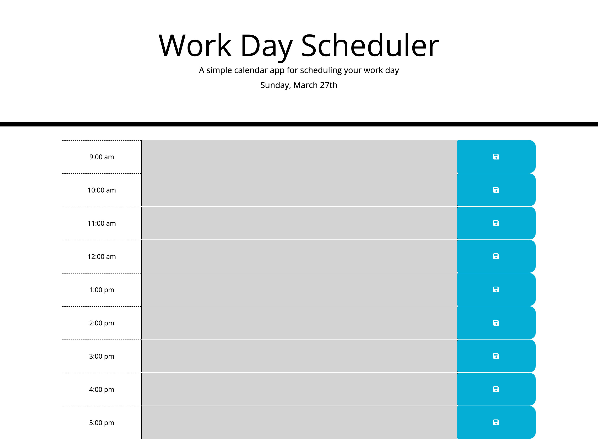

# Work Day Scheduler Starter Code

## Tools used

- HTML
- CSS
- Bootstrap
- Moment.js

## Description

A simple planner to schedule out tasks for typical workday. This project uses moment.js to get the current time and date display the current day on the page. It then uses the current time to show past, present, and future tasks to be done. The user can enter tasks to be done in each time category and save the task with the save button. When the save button is pressed, that task is stored in localStorage and is reloaded when the user reopens the page.

## Link to Page

https://charliefontanez.github.io/workday-scheduler/